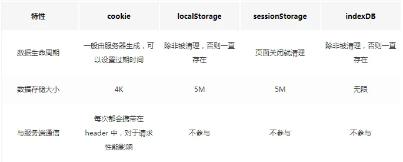

# Browser Series

## 浏览器的存储方式有哪些？

目前主流浏览器的几种存储方式有：cookie、sessionStorage、localStorage、IndexedDB
这几种存储方式的区别：
- 存储限制：cookie 的大小限制为 4KB（很多浏览器会限制一个网址最多保存20个cookie），sessionStorage 和 localStorage 为 5M，IndexedDB 理论上来说没有限制（一般来说不会小于 250 M）;
- 生命周期：cookie 可以设置过期时间 Expires 或有效期 Max-Age，默认一关闭浏览器窗口就失效，sesionStorage 和 localStorage 不能设置有效期或者过期时间，sesionStorage 一关闭会话就会被清理，localStorage 如何不手动清理就会一直存在，IndexedDB 同样是除非手动清理，否则一直存在；
- 与服务端通信：cookie 会存在于每次请求的 header 中，其他三个则只会存在于客户端；

## 在浏览器地址栏输入 url 到浏览器页面渲染的过程中发生了什么？

- 查找缓存，有缓存则直接返回缓存；
- DNS 解析获取 ip 地址
- TCP 建立连接
- 如果是 https，还要建立 TLS 连接
- 如果请求返回的是 301 或 302 则进行重定向
- 如果返回的是 200，则继续解析响应数据
- 渲染
  - 构建 DOM 树 
  - 样式计算
  - 布局：生成布局树、布局计算
  - 分层
  - 图层绘制
  - 栅格化操作
  - 合成与显示

## 重排、重绘、直接合成了解吗，请简单描述一下？

- 重排：只要进行了影响布局的操作，就会触发重排，重排包括了样式计算后的所有渲染操作，触发操作罗列如下：
  - 添加或者删除可见的DOM元素；
  - 元素尺寸改变——边距、填充、边框、宽度和高度；
  - 浏览器窗口尺寸改变——resize事件发生时；
- 重绘：假如我们更改了跟布局无关的一些 css 样式，则会触发重绘，重绘包括了分层之后的所有渲染操作；（重排一定会触发重绘）
- 直接合成：当动画作用于可合成属性（如 transform、opacity）且元素已有合成层时，每帧无需布局（layout）和重绘（paint），仅由合成器更新图层位置或透明度；但首帧可能发生图层创建与一次性栅格化绘制。为确保走合成路径，可使用 will-change: transform 或 transform: translateZ(0) 提示浏览器提前创建合成层（注意不要过度使用）。